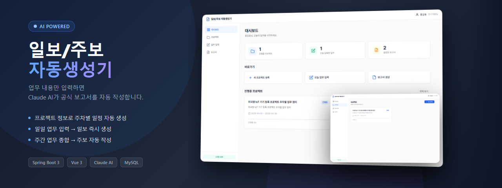
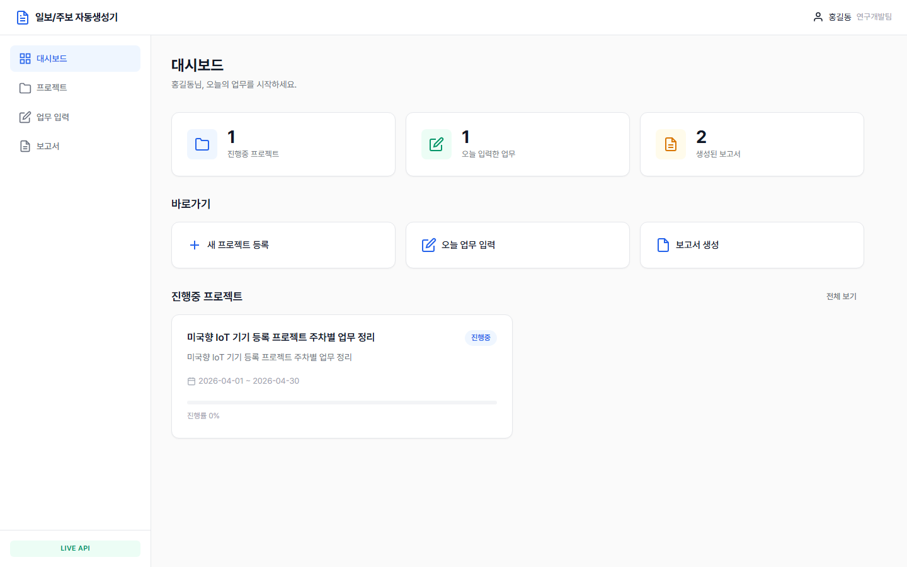
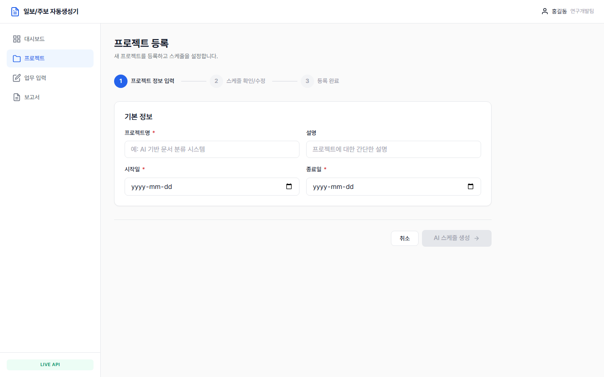
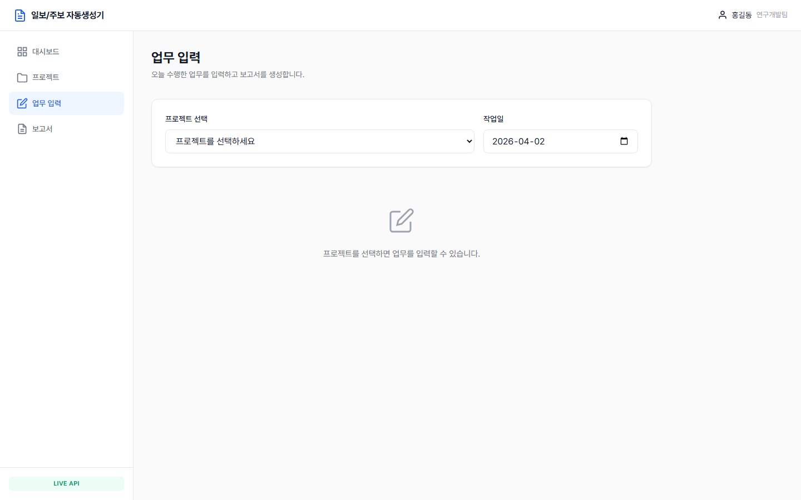
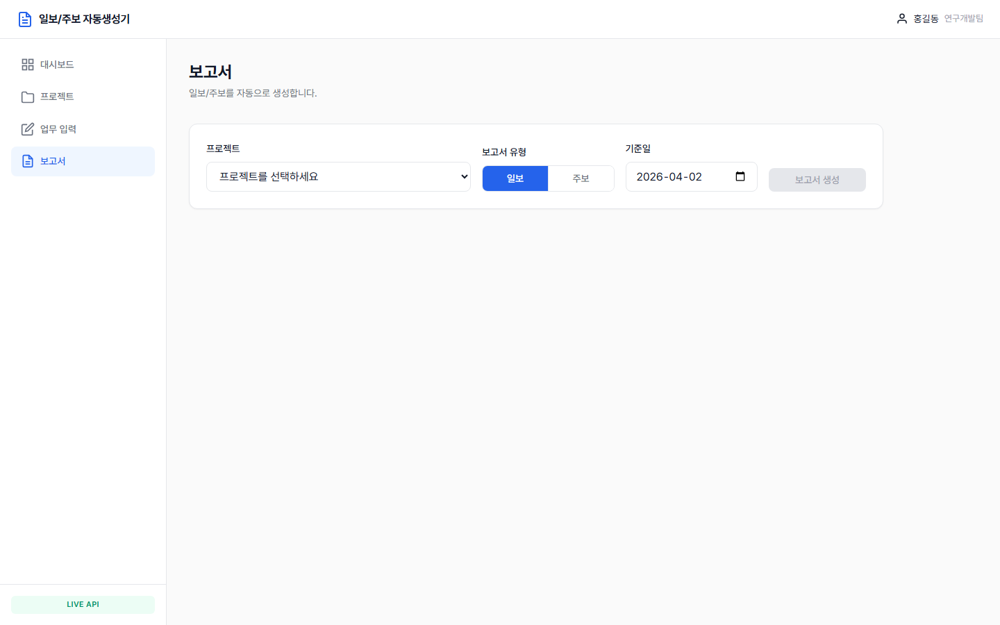

# 📋 AutoK BS — 일보/주보 자동생성기

> **업무 내용을 입력하면 Claude AI가 공식 보고서를 자동으로 작성해 드립니다.**  
> 프로젝트 등록부터 주차별 일정 생성, 일보·주보 작성까지 — 보고를 위한 보고, 빠르게 끝냅니다.

<br>



<br>

## ✨ 주요 기능

| 기능 | 설명 |
|------|------|
| 🗂️ **프로젝트 관리** | 프로젝트 생성 및 진행 상태 관리 |
| 🤖 **AI 일정 자동 생성** | 시작일·종료일 입력만으로 Claude AI가 주차별 일정 자동 생성 |
| ✏️ **업무 입력** | 날짜별 수행 업무를 간단하게 기록 |
| 📄 **일보 자동 작성** | 입력한 업무를 공식 일일 업무 보고서 형식으로 변환 |
| 📊 **주보 자동 작성** | 주간 업무를 종합하여 주간 보고서 자동 생성 |
| 📜 **보고서 이력 관리** | 생성된 보고서 히스토리 조회 및 재활용 |

<br>

## 🖥️ 스크린샷

### 대시보드


### 프로젝트 등록 — AI 스케줄 자동 생성


### 업무 입력


### 보고서 생성 결과


<br>

## 🛠️ 기술 스택

### Frontend


### Backend


### AI


<br>

## 🚀 시작하기

### 사전 요구사항
- Java 17+
- Node.js 18+
- MySQL 8.0+

### 1. 저장소 클론

```bash
git clone https://github.com/Kim971202/AutoK_BS.git
cd AutoK_BS
```

### 2. 백엔드 설정

`backend/src/main/resources/application-secret.properties` 파일 생성:

```properties
spring.datasource.url=jdbc:mysql://localhost:3306/autok_bs
spring.datasource.username=YOUR_DB_USER
spring.datasource.password=YOUR_DB_PASSWORD
claude.api.key=YOUR_CLAUDE_API_KEY
```

```bash
cd backend
./mvnw spring-boot:run
```

### 3. 프론트엔드 설정

```bash
cd frontend
npm install
npm run dev
```

브라우저에서 `http://localhost:5173` 접속

<br>

## 📖 사용 흐름

```
1. 프로젝트 등록
   └─ 이름, 설명, 시작일, 종료일 입력
   └─ AI가 주차별 스케줄 자동 생성
   └─ 스케줄 확인/수정 후 확정

2. 업무 입력 (/daily-work)
   └─ 프로젝트 선택
   └─ 날짜 선택
   └─ 오늘 수행한 업무 내용 입력 & 저장

3. 보고서 생성 (/reports)
   └─ 프로젝트 + 유형(일보/주보) + 날짜 선택
   └─ "보고서 생성" 클릭
   └─ Claude AI가 공식 보고서 자동 작성
```

<br>

## 📁 프로젝트 구조

```
AutoK_BS/
├── backend/                  # Spring Boot 백엔드
│   └── src/main/java/com/autok/report/
│       ├── domain/
│       │   ├── project/      # 프로젝트 관리
│       │   ├── schedule/     # 주차별 일정
│       │   ├── dailywork/    # 일일 업무 입력
│       │   └── report/       # 보고서 생성
│       └── global/
│           ├── claude/       # Claude API 연동
│           └── config/       # 보안, CORS 설정
│
└── frontend/                 # Vue 3 프론트엔드
    └── src/
        ├── views/            # 페이지 컴포넌트
        ├── components/       # 공통 UI 컴포넌트
        └── api/              # API 통신 레이어
```

<br>

## 📝 보고서 예시

<details>
<summary>일보 예시 보기</summary>

```
[일일 업무 보고서]
작성일: 2026-04-02
프로젝트: AutoK BS 개발

━━━━━━━━━━━━━━━━━━━━━━━━━━━━━━

1. 금일 수행 업무
   1-1. 백엔드 개발
       - Claude API 연동 모듈 구현 완료
       - 보고서 생성 엔드포인트 개발 (POST /api/reports/generate)

   1-2. 프론트엔드 개발
       - 보고서 생성 UI 컴포넌트 구현
       - 업무 입력 폼 유효성 검사 추가

2. 특이사항 / 이슈
   - 없음

3. 익일 계획
   - 테스트 케이스 작성
   - 배포 환경 구성

━━━━━━━━━━━━━━━━━━━━━━━━━━━━━━
```

</details>

<br>

## 🔑 환경변수

| 변수명 | 설명 |
|--------|------|
| `spring.datasource.url` | MySQL 데이터베이스 URL |
| `spring.datasource.username` | DB 사용자명 |
| `spring.datasource.password` | DB 비밀번호 |
| `claude.api.key` | Anthropic Claude API 키 |

<br>

---

<div align="center">
  Made with ☕ and Claude AI
</div>
